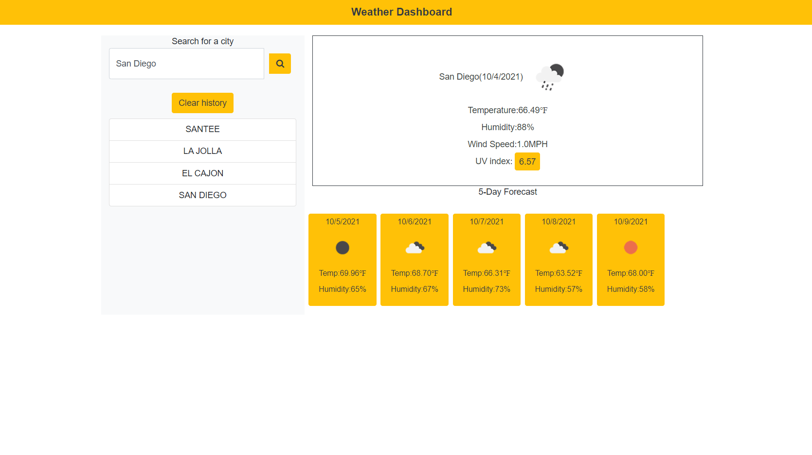

# weather-dashboard

## Description

For a traveler user and those who check the weather chanel before planing to go out, i bulid an aplictaion that will help them finding the weather condtion for a mulitaple cities using the api's for the OpenWeather [https://openweathermap.org/](https://openweathermap.org/) to get the accuret weather in the time that the user is logging in.

## Installation

I started analyzing the structure of the HTML and with the Javascript, using the bootstrap, jquery, cloudflare and simple css to finlize the final design that is user friendly and colore attraction to make it look more modren and fun.

## Usage

A screenshot of the project

## Credits

in collabration wiht:
- [https://google.com/](https://google.com/).
- [https://developer.mozilla.org/en-US/](https://developer.mozilla.org/en-US/).
- [https://openweathermap.org/api](https://openweathermap.org/api).
- [https://getbootstrap.com/](https://getbootstrap.com/).
- [https://www.cloudflare.com/](https://www.cloudflare.com/).
- [https://jquery.com/](https://jquery.com/).

and of course, my Instructor John Desrosiers and Wells Wu (the teacher's assistance) guided me and help me understand the material to complete this project.
